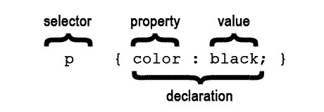

# FEWD LESSON 2

## MORE HTML/CSS BASICS

### Instructors
Kit Yuen & Mart van de Ven 


## Agenda

* Quiz
* Decking out Sublime
* Show and tell: Introducing the HTML Template
* What is CSS?
* Page Layout & CSS
* CSS: Fonts & Text
* Color and Image file Types
* HTML Extended
* Hitting the Road: Create your travel blog


## Quiz
<aside class="notes"></aside>

1. Name some of the roles involved in building a complex web app.
1. Fill in the blanks using two of the following words: code, style, structure, behavior, images.
  * The 'separation of concerns' states that HTML provides the (______) for a web page, and CSS the (______).
1. Write the HTML to create a HTML5 doctype.
1. TRUE OR FALSE? HTML, CSS and JavaScript are processed on the client side.
1. Write the code for a hyperlink that links to 'http://www.google.com' and opens in a new browser window.


## Decking out Sublime
<aside class="notes"></aside>

* Package control (Google)
* SFTP sublime (Google)


## Show and tell: Introducing the HTML Template
<aside class="notes"></aside>

Review:

* HTML `<a>`, ``, image links
* CSS: background properties

<br>

Introducing:

* `<blockquote>`
* `<div>`


## Show and tell: Introducing the HTML Template
<aside class="notes"></aside>

```
<!doctype html> 
<html lang="en">  
  <head>  
    <meta charset="utf-8">  
    <meta name="description" content=""> 
    <title>Page Title</title>
    <link rel="stylesheet" href="css/style.css">
    <link rel="stylesheet" href="css/normalize.css">  
    <style></style> 
  <body>
    <!-- BODY -->
  </body>
</html>
```


## What is CSS?
<aside class="notes"></aside>

Cascading Style Sheets (CSS) is the central place to define your page styling.

* It’s a style language
* Separates presentation from mark-up
* Powerful and concise selectors

<br>

[CSS Zen garden](http://www.csszengarden.com/)


## What is CSS?
<aside class="notes"></aside>

* Inline
```
<p style="color: red;"></p>
```
* Internal
```
<style>
  p { color: red; }
</style>
```
* External
```
<link rel="stylesheet" type="text/css" href="style.css">
```


## What is CSS?
<aside class="notes"></aside>

CSS Syntax




## What is CSS?
<aside class="notes"></aside>

* IMPORTANCE
* SPECIFICITY
* INHERITANCE


## What is CSS?
<aside class="notes"></aside>

What is our favorite styled web page?

* [Connected China](http://connectedchina.reuters.com/)
* [Google Glass](http://www.google.com/glass/start/)
* [mixpanel](https://mixpanel.com/)


## Page Layout & CSS
<aside class="notes"></aside>

Labs

* pageLayout


## CSS: Fonts & Text
<aside class="notes"></aside>

font-size
```
body { font-size: 12px; }
```

Unit

* px
* em
* %


## CSS: Fonts & Text
<aside class="notes"></aside>

font-style

Allows italic or oblique faces to be selected within a font-family. 

```
body { font-style: italic; }
```


## CSS: Fonts & Text
<aside class="notes"></aside>

font-weight

```
body { font-style: bold; }
```


## CSS: Fonts & Text
<aside class="notes"></aside>

text-decoration

```
body { text-decoration: underline; }
```


## CSS: Fonts & Text
<aside class="notes"></aside>

font-family

```
body { font-family: Helvetica, Arial, san-serif; }
```


## Color and Image file Types
<aside class="notes"></aside>

* Names
* Hexadecimal
* RGB
* RGBA


## Color and Image file Types
<aside class="notes"></aside>

color

```
body { color: pink }
body { color: #f00 }
body { color: #ff0000 }
body { color: rgb(255,0,0) }
```


## Color and Image file Types
<aside class="notes"></aside>

### Name

There are 147 color names 16 of which are standard:

* aqua, black, blue
* fuchsia, gray/grey
* green, lime, maroon
* navy, olive, purple
* red, silver, teal
* white, yellow


## Color and Image file Types
<aside class="notes"></aside>

### Hexadecimal

These colors when used in different combinations can produce any color that is needed.

For example, in the color red, the color code is #FF0000, which is '255' red, '0' green, and '0' blue.

Hex system values use combinations of the characters 0-9 as well as A-F.


## Color and Image file Types
<aside class="notes"></aside>

### RGB & RGBA

RGB (Red Green Blue)
* rgb(100,86,92);

<br>

A (Alpha) allows an additional accepted value from 0-1 (o%-100% opacity)
* rgba(100,86,92,0.5);


## Color and Image file Types
<aside class="notes"></aside>

Image Formats

* GIF (Graphics Interchange Format)
* JPG (JPEG) (Joint Photographic Experts Group)
* PNG (Portable Network Graphic)
* SVG (Scalable Vector Graphic)


## HTML Extended
<aside class="notes"></aside>

* `<header>`
* `<footer>`
* `<aside>`
* `<article>`
* `<section>`

<br>

... coming in HTML 5.1

* `<main>`


## Hitting the Road: Create your travel blog
<aside class="notes"></aside>


## Homework
<aside class="notes"></aside>

Create a website for your favourite band consisting of at least 3 pages, featuring the various HTML elements and CSS properties introduced so far

* Use both HTML
* elements and CSS background images
* Embed at least 1 YouTube or Vimeo video
* Embed a Google Map on the band's tour page
* Push your project code to GitHub
* Students will come to class #03 with your projects underway. We’ll answer any questions you may have. Your project will be submitted for assessment before class #04